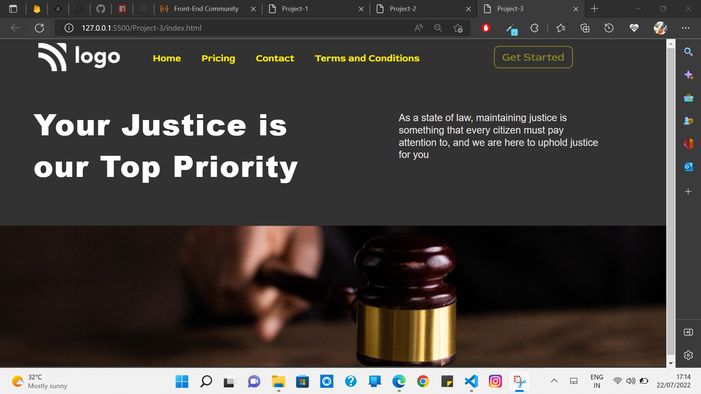
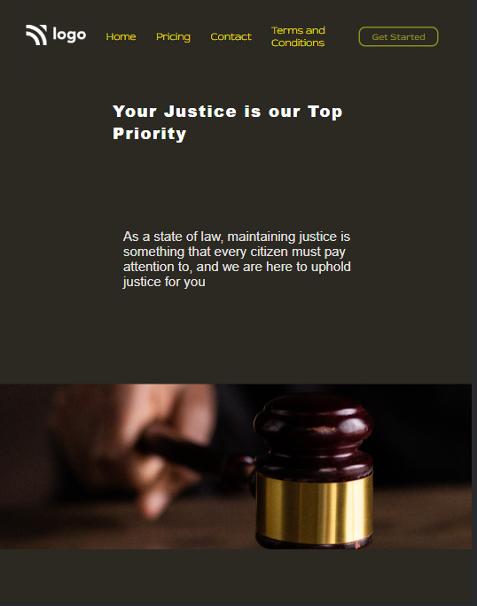

# Project-3

[Live link Project-3](https://vinod-kumar-project-3.netlify.app/)

-   I learned this project
    -   More about navbars, positions and bg image position layers and flexbox.

---

## Duration of complete this project

-   Approx 3 hour taken to complete this project and I am working as fulltime employee in non iT and I am working between night 7:30 to 11:00 PM.
-   -   Now Mobile version also available.

## **The website same as below image**

